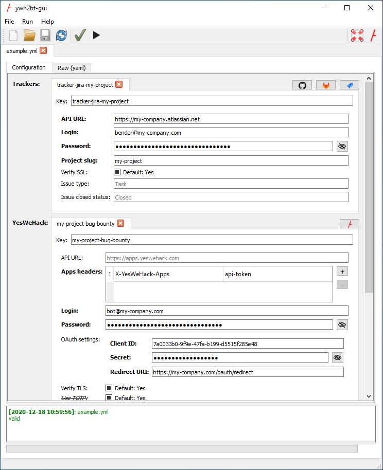

# ywh2bt

ywh2bt synchronizes your vulnerability reports from the [Yes We Hack platform][YesWeHack-Platform]
with issues of your bug tracker(s). It automatically retrieves reports you want to copy in your bug tracker,
creates the related issue, and syncs further updates between issues and reports.  
It comes with a handy GUI to set up and test the integration,
while completely controlling the information you allow to be synchronized from both side.

## Table of contents

- [User Guide](#user-guide)
- [Architecture](#architecture)
- [Requirements](#requirements)
- [Installation](#installation)
- [Supported trackers](#supported-trackers)
- [Changelog](#changelog)
- [Local development](#local-development)
    - [Requirements](#requirements-1)
    - [Installation](#installation-1)
    - [Usage](#usage-1)
    - [Updating User Guide](#updating-user-guide)

## User Guide

A User Guide is available in [PDF][User-Guide-pdf] and [HTML][User-Guide-html] formats.

## Architecture

YWH2BT embeds both the GUI to set up the integration,
and the application to be scheduled on your server to periodically poll and synchronize new reports.  
You can either run both on a single machine, or prepare the configuration file
on a computer (with the GUI) and transfer it on the server and use it through a scheduled command.

Since data is pulled from YWH platform to your server, only regular outbound web connections need to be authorized on your server.

## Requirements

- `python` >= 3.7,<=3.9
- [`pip`](https://pip.pypa.io/en/stable/installing/)

## Supported trackers

- github
- gitlab
- jira / jiracloud
- servicenow

## Changelog

- v2.5:
    - added Personal Access Token (PAT) authentication
    - removed OAuth authentication
- v2.4:
    - added option to prevent recreation of issues that were created by a previous synchronization
      but are not found into the bug tracker anymore
- v2.3:
    - added support for ServiceNow
- v2.2:
    - added GitLab option for confidential issues
- v2.1:
    - added feedback feature (synchronize from bug tracker to report)
    - added [docker image yeswehack/ywh2bugtracker](https://hub.docker.com/r/yeswehack/ywh2bugtracker)
    - added User Guide [PDF][User-Guide-pdf] and [HTML][User-Guide-html]
- v0.* to v2.0.0:
    - behavior changes:
        - reports logs can selectively be synchronized with the trackers:
            - public comments
            - private comments
            - report details changes
            - report status changes
            - rewards
        - a program can now only be synchronized with 1 tracker
    - added support for JSON configuration files
    - removed `ywh-bugtracker` command (use `ywh2bt synchronize`)
    - added `ywh2bt` command:
        - added `ywh2bt synchronize`:
            - note: `ywh2bt synchronize --config-file FILE --config-format FORMAT` 
              is the equivalent of `ywh-bugtracker -n -f FILE` in v0.*
        - added `ywh2bt validate`
        - added `ywh2bt test`
        - added `ywh2bt convert`
        - added `ywh2bt schema`
    - removed command line interactive mode
    - added GUI via `ywh2bt-gui` command

## Local development

### Requirements

- [`poetry`](https://python-poetry.org/) (`pip install poetry`)

### Installation

- `make install` (or `poetry install`): creates a virtualenv and install dependencies

### Usage

Instead of `ywh2bt [command]`, run commands using `poetry run ywh2bt [command]`.

Same goes for `ywh2bt-gui`, run `poetry run ywh2bt-gui` instead.

### Updating User Guide

[PDF][User-Guide-pdf] and [HTML][User-Guide-html] versions of the User Guide are generated via Pandoc
using [docs/User-Guide.md][User-Guide-md] as an input file.  
Any changes made to [docs/User-Guide.md][User-Guide-md] **must be followed** by the execution of the command
`make user-guide` in order to regenerate the PDF and HTML files, **otherwise the CI will fail**.

[YesWeHack-Platform]: https://www.yeswehack.com/

[User-Guide-md]: docs/User-Guide.md

[User-Guide-pdf]: docs/user-guide/User-Guide.pdf

[User-Guide-html]: docs/user-guide/User-Guide.html
