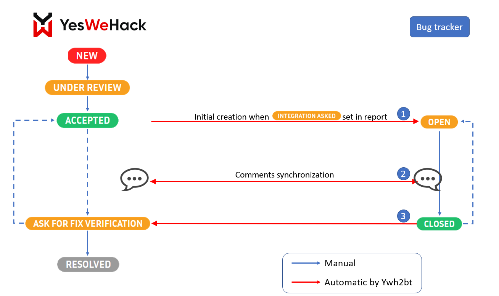
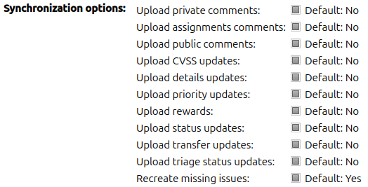
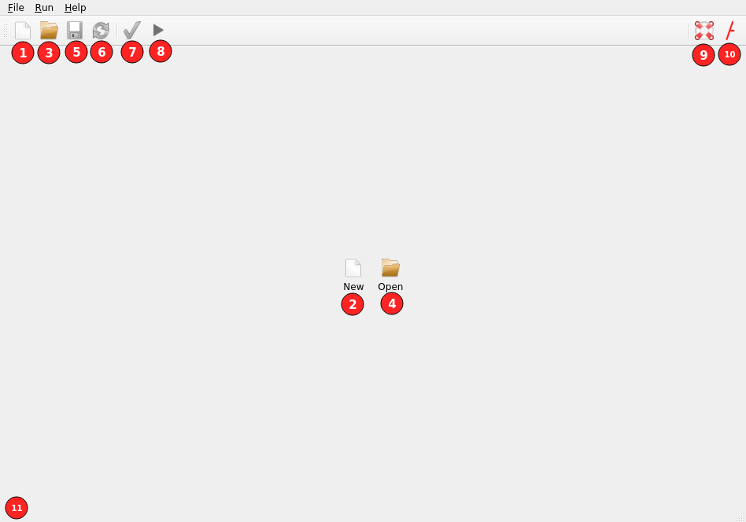
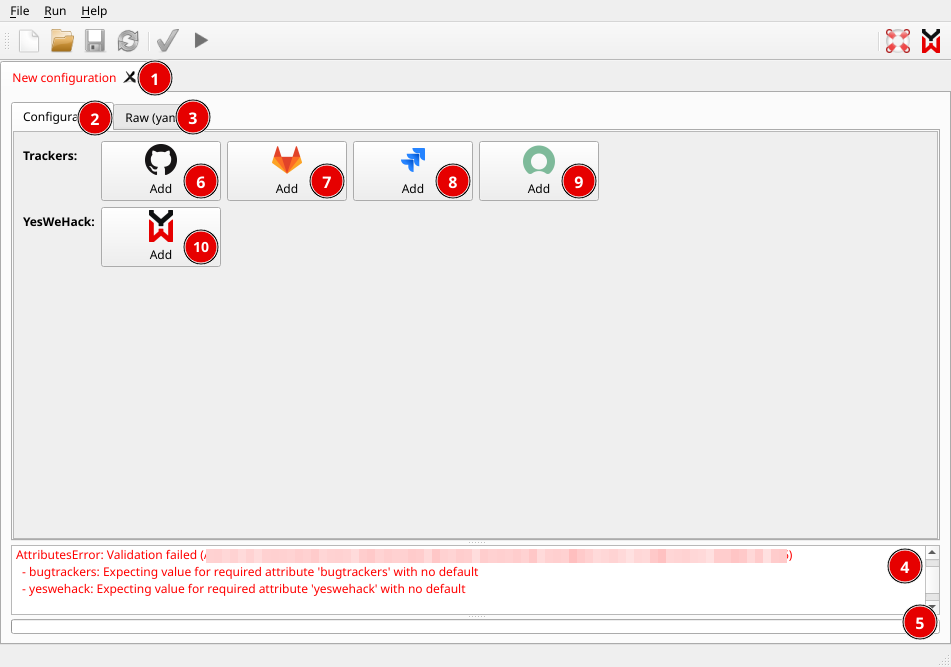
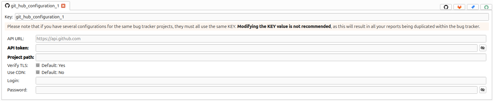
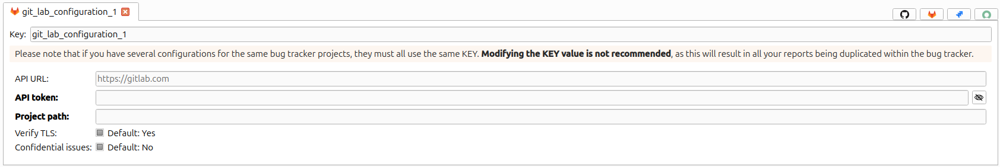
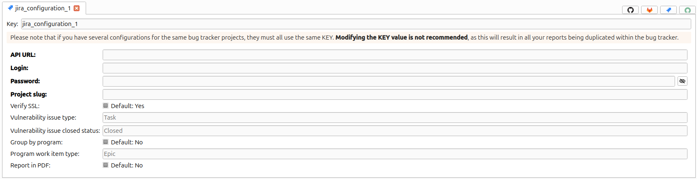
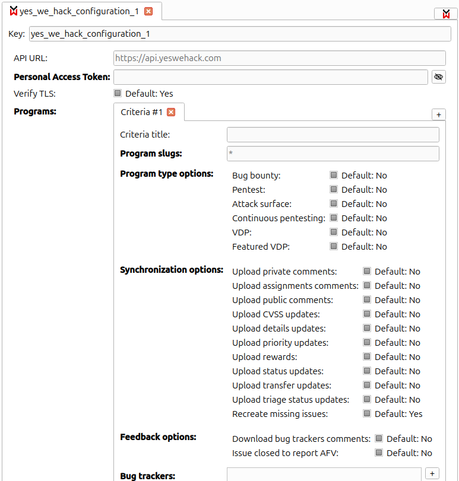

YWH2BT synchronizes your vulnerability reports with issues of your bug tracker(s).
It automatically retrieves reports you want to copy in your bug tracker,
creates the related issue, and syncs further updates between issues and reports.  
It comes with a handy GUI to set up and test the integration,
while completely controlling the information you allow to be synchronized from both side.

It supports github, gitlab, jira/jiracloud and servicenow.

# Architecture

YWH2BT embeds both the GUI to set up the integration,
and the application to be scheduled on your server to periodically poll and synchronize new reports.  
You can either run both on a single machine, or prepare the configuration file
on a computer (with the GUI) and transfer it on the server and use it through a scheduled command.

Since data is pulled from the [Yes We Hack platform][YesWeHack-Platform] to your server,
only regular outbound web connections need to be authorized on your server.

# Requirements

- `python` >= 3.7,<=3.9
- [`pip`](https://pip.pypa.io/en/stable/installing/)

To use it on your program, while maintaining the maximum security, the tool requires:

- a specific right on the [Yes We Hack platform][YesWeHack-Platform] allowing you to use the API,
  and a custom HTTP header to put in your configuration.
  Both of them can be obtained by e-mailing us at [support@yeswehack.com](mailto:support@yeswehack.com).
- creation of a user with role "program consumer" on the desired program.
  It is the credentials of this user that you must use in the configuration.

# Installation

YWH2BT can be installed with `pip`, through the command:
```sh
pip install ywh2bt
```

Or upgraded from a previously installed version:
```sh
pip install ywh2bt --upgrade
```

If you need to deploy only the command line version on a server, a runnable docker image is also available.
You can install it with:
```sh
docker pull yeswehack/ywh2bugtracker:latest
```
Then, run it with the same command as described [below](#command-line), prefixed with `docker run yeswehack/ywh2bugtracker`.   
See `docker run yeswehack/ywh2bugtracker -h` or `docker run yeswehack/ywh2bugtracker [command] -h` for detailed help.

# Usage

## Workflow



1. Issue creation is achieved upon first synchronization after "Ask for integration" (AFI) Tracking Status is set
  * When integrated, Tracking Status is automatically set to "Tracked"
  * Creation is possible whatever report status.
    It is however advised to set AFI status only after acceptance, 
    since the report is from this point considered valid.
  * Subsequent returns to "Ask for integration" status won’t create another issue.
2. The types of comments synchronized depends on [configuration](#yes-we-hack-integration):
  * Updates pushed from reports to issues:  
    
  * Updates pushed from issues to reports:  
    
3. "Ask for fix verification" can only be set from "Accepted" status, otherwise it will fail and not be retried later.

## GUI

The Graphical User Interface provides assistance to create, modify and validate/test configurations. 
It also allows synchronization with bug trackers.

To run it, simply type `ywh2bt-gui` in a shell.

### GUI tips

- Form labels in **bold font** means that the field is mandatory.
- Form labels in ~~_striked and italic font_~~ means that the field is deprecated
  and will be removed in a future release of the tool.
- Hovering form labels and buttons with the mouse pointer often reveals more information in a floating tooltip 
  or in the status bar.

### Welcome screen



Legend:

- 1, 2: Create a new configuration
- 3, 4: Open an existing configuration file
- 5: Save the current configuration into a file
- 6: Reload the current configuration from the original file
- 7: Test the current configuration
- 8: Execute the synchronization using the current configuration
- 9: Show a detailed description of the configuration schema
- 10: Show information about ywh2bt
- 11: Status bar (details about the hovered UI item, ...)

### New configuration screen



Legend:

- 1: Name of the configuration file. **If text color is red, the configuration is not valid.**
- 2: Visual mode tab, for modifying the configuration through a form.
  Changes made in this tab are automatically reflected in the raw mode tab.
- 3: Raw mode tab, for modifying the configuration in plain text.
  Changes made in this tab are automatically reflected in the visual mode tab.
- 4: Logs panel (error messages, event logs, ...)
- 5: Progress bar indicating a running test or synchronization
- 6: Add a new [GitHub tracker integration](#github-integration)
- 7: Add a new [GitLab tracker integration](#gitlab-integration)
- 8: Add a new [Jira tracker integration](#jira-integration)
- 9: Add a new [ServiceNow tracker integration](#servicenow-integration)
- 10: Add a new [Yes We Hack integration](#yes-we-hack-integration)

### Integrations

#### GitHub integration



##### Requirements

- Create a GitHub API access token:
    - Go to your GitHub account
    - In _Settings > Developer settings > Personal access tokens_, click _Generate new token_.
    - Name the token and select the scopes:
      If the repository in which you want to integrate the issues is:
        - public: choose "Access public repositories" (`public_repo`) scope
        - private: choose "Full control of private repositories" (`repo`) scope
    - Click "Generate token".
    - Make sure to copy the token. You won’t be able to see it again!

##### Configuration

- **Key**: a unique name identifying this integration.  
  This will be used when configuring [Yes We Hack integration](#yes-we-hack-integration)
- **API URL**: GitHub API URL (if different from the default one).
- **API token**: GitHub API access token previously created.
- **Project path**: path of the project on github.com.  
  e.g. for the project located at `https://github.com/yeswehack/ywh2bugtracker`, the path is `yeswehack/ywh2bugtracker`.
- **Verify TLS**: whether to verify if the API server's TLS certificate is valid.
- **Use CDN**: When activated, this option allows upload of file attachments using a workaround because GitHub API does
  not natively provide a functionality to upload attachments on issues.
- **Login**: GitHub account login. Only used when "Use CDN" is activated.
- **Password**: GitHub account password. Only used when "Use CDN" is activated.

#### GitLab integration



##### Requirements

- Create a GitLab API access token:
    - Go to your GitLab account
    - Go to _Preferences > User Settings > Access Tokens_.
    - Name the token and select the `api` scope.
    - Click "Create personal access token".
    - Make sure to copy the token. You won’t be able to see it again!

##### Configuration

- **Key**: a unique name identifying this integration.  
  This will be used when configuring [Yes We Hack integration](#yes-we-hack-integration)
- **API URL**: GitLab API URL (if different from the default one).
- **API token**: GitLab API access token previously created.
- **Project path**: path of the project on gitlab.com.  
  e.g. for the project located at `https://gitlab.com/yeswehack/ywh2bugtracker`, the path is `yeswehack/ywh2bugtracker`.
- **Verify TLS**: whether to verify if the API server's TLS certificate is valid.
- **Confidential issues**: whether to mark created issues as confidential.

#### Jira integration



##### Requirements

- Create a Jira API token:
    - Go to your Atlassian account
    - Go to _Security > API token > Create and manage API tokens_.
    - Click "Create an API token".
    - Name the token.
    - Click "Create".
    - Make sure to copy the token. You won’t be able to see it again!

##### Configuration

- **Key**: a unique name identifying this integration.  
  This will be used when configuring [Yes We Hack integration](#yes-we-hack-integration)
- **API URL**: Jira API URL.
- **Login**: Jira account login.
- **Password**: Jira API token previously created.
- **Project slug**: project key as defined in Jira (see _Project settings > Details > Key_).
- **Verify TLS**: whether to verify if the API server's TLS certificate is valid.
- **Issue type**: type of issue to be created (in Jira, see _Project settings > Issue types_
  for a list of valid types). **This value is sensitive to the Jira account language.**
- **Issue closed status**: name of the workflow status for which the issue is considered closed/done. **This value is
  sensitive to the Jira account language.**

#### ServiceNow integration


##### Requirements

- Create a new user in your ServiceNow instance:
  - In _User Administration > Users_, click the _New_ button.
  - Fill in the details about the new user, providing **at least**:
    - _User ID_
    - _Password_  
    **It is strongly recommended** to check _Web service access only_ in order
    to prevent the user from accessing the ServiceNow UI.
  - Click the _Submit_ button to create the user.
- In order to read and modify the Additional Comments on the ServiceNow incidents,
  users must be granted a specific role that allows access controls on the `sys_journal_field` table:
  - In _System Definition > Tables_, open "Journal Entry" / `sys_journal_field`.
  - Select the _Controls_ tab.
  - Check _Create access controls_.
  - In the _User role_ field, enter `u_journal_entry_user` or leave the default value.
  - Click the _Update_ button.
- Apply the user roles to the user:
  - In _User Administration > Users_, open the user you created earlier.
  - Select the _Roles_ tab.
  - Click the _Edit_ button.
  - Move the following items from the list on the left to the list on the right:
    - `snc_platform_rest_api_access`: allows access to Platform Rest APIs
    - `sn_incident_read`: read access to the Incident Management Application and related functions
    - `sn_incident_write`: write access to the Incident Management Application and related functions
    - `u_journal_entry_user` (or the role you defined earlier): allows access to the `sys_journal_field` table
  - Click the _Save_ button to save the roles.
  - Click the _Update_ button to update the user.

##### Configuration

- **Key**: a unique name identifying this integration.  
  This will be used when configuring [Yes We Hack integration](#yes-we-hack-integration)
- **Instance host**: ServiceNow instance host (e.g. `my-instance.service-now.com`).
- **Login**: ServiceNow user login.
- **Password**: ServiceNow user password.
- **Use SSL**: whether to use SSL connection with the server.
- **Verify TLS**: whether to verify if the API server's TLS certificate is valid.

#### Yes We Hack integration



##### Requirements

- Have a user account on the [Yes We Hack platform][YesWeHack-Platform].
  This account will be used by the tool to interact with the platform:
  - the user must have created an API Apps (_Account > My Yes We Hack -> API Apps_)
  - the user must have the "Program Consumer" role on the programs, given by the Program or Business Unit manager
- Be in possession of a custom HTTP header token that can be obtained by e-mailing [support@yeswehack.com](mailto:support@yeswehack.com)

More information on how to set up API Apps or user roles are available in the official Yes We Hack User Guide
that can be downloaded from the [Yes We Hack platform][YesWeHack-Platform].

##### Configuration

- **Key**: a unique name identifying this integration.
- **API URL**: [Yes We Hack platform][YesWeHack-Platform] API URL.
- **App headers**: a list of pairs of HTTP headers (header name and header value) 
  that will be added to every call to the API.  
  This list **must** include a pair with a header named `X-YesWeHack-Apps` and the value given by the Yes We Hack support.
  See [Requirements](#requirements-4).
- **Login**: Yes We Hack platform account login.
- **Password**: Yes We Hack platform account password.
- **OAuth settings**:
  - **Client ID**: OAuth client ID.
  - **Secret**: OAuth secret.
  - **Redirect URI**: OAuth redirect.
- **Verify TLS**: whether to verify if the API server's TLS certificate is valid.
- **Programs**: a list of programs to be synchronized.
  - **Program slug**: a program slug.
  - **Synchronization options**: options for synchronizing a Yes We Hack report with the bug trackers.
    - **Upload private comments**: whether to upload the reports private comments into the bug trackers.
    - **Upload public comments**: whether to upload the reports public comments into the bug trackers.
    - **Upload details updates**: whether to upload the reports details updates into the bug trackers.
    - **Upload rewards**: whether to upload the reports rewards into the bug trackers.
    - **Upload status updates**: whether to upload the reports status updates into the bug trackers.
  - **Feedback options**: options for synchronizing bug trackers issues with Yes We Hack reports.
    - **Download bug trackers comments**: whether to download comments from the bug trackers
      and put them into the reports.
    - **Issue closed to report AFV**: whether to set the reports status to "Ask for Fix Verification" 
      when the tracker issues are closed.
  - **Bug trackers**: a list of bug trackers keys.
      
## Command line

The main script `ywh2bt` is used to execute synchronization, validate and test configurations.

**Usage**: `ywh2bt [command]`.  
See `ywh2bt -h` or `ywh2bt [command] -h` for detailed help.

Where `[command]` can be:

- `validate`: validate a configuration file (mandatory fields, data types, ...)
- `test`: test the connection to the trackers
- `convert`: convert a configuration file into another format
- `synchronize` (alias `sync`): synchronize trackers with YesWeHack reports. It should be run everytime you want to synchronize (e.g. schedule execution in a crontab).
- `schema`: dump a schema of the structure of the configuration files in [Json-Schema][Json-Schema], markdown 
  or plaintext
  
### Supported configuration file formats

- `yaml` (legacy)
- `json`

Use `ywh2bt schema -f json` to obtain a [Json-Schema][Json-Schema] describing the format.
Both `yaml` and `json` configuration files should conform to the schema. 

### Examples

Validation:
```sh
$ ywh2bt validate \
    --config-file=my-config.yml \
    --config-format=yaml && echo OK
OK
```

Conversion (`yaml` to `json`):
```sh
$ ywh2bt convert \
    --config-file=my-config.yml \
    --config-format=yaml \
    --destination-file=/tmp/cfg.json \
    --destination-format=json
```

Synchronization:
```sh
$ ywh2bt synchronize --config-file=my-config.json --config-format=json
[2020-12-21 10:20:58.881315] Starting synchronization:
[2020-12-21 10:20:58.881608]   Processing YesWeHack "yeswehack1":
[2020-12-21 10:20:58.881627]     Fetching reports for program "my-program": 2 report(s)
[2020-12-21 10:21:08.341460]     Processing report #123 (CVE-2017-11882 on program) with "my-github": https://github.com/user/project/issues/420 (untouched ; 0 comment(s) added) | tracking status unchanged
[2020-12-21 10:21:09.656178]     Processing report #96 (I found a bug) with "my-github": https://github.com/user/project/issues/987 (created ; 3 comment(s) added) | tracking status updated
[2020-12-21 10:21:10.773688] Synchronization done.
```

Synchronization through docker:
```sh
$ docker run \
    --volume /home/dave/config/my-config.json:/ywh2bt/config/my-config.json \
    --network host \
    yeswehack/ywh2bugtracker:latest \
    sync --config-file=/ywh2bt/config/my-config.json --config-format=json
[2020-12-21 11:20:58.881315] Starting synchronization:
[2020-12-21 11:20:58.881608]   Processing YesWeHack "yeswehack1":
[2020-12-21 11:20:58.881627]     Fetching reports for program "my-program": 2 report(s)
[2020-12-21 11:21:08.341460]     Processing report #123 (CVE-2017-11882 on program) with "my-github": https://github.com/user/project/issues/420 (untouched ; 0 comment(s) added) | tracking status unchanged
[2020-12-21 11:21:09.656178]     Processing report #96 (I found a bug) with "my-github": https://github.com/user/project/issues/987 (created ; 3 comment(s) added) | tracking status updated
[2020-12-21 11:21:10.773688] Synchronization done.
```

# Known limitations and specific behaviours

## Yes We Hack API TOTP

Apps API doesn't require TOTP authentication, even if corresponding user has TOTP enabled.  
However, on a secured program, information is limited for user with TOTP disabled, even in apps.  
As a consequence, to allow proper bug tracking integration on a secured program,
program consumer must have TOTP enabled and, in [Yes We Hack integration](#yes-we-hack-integration) TOTP must be set to `false`.

## Reports manual tracking

Manually tracked reports (i.e., where a manager directly set the Tracking status to "tracked") 
are also integrated in the tracker the way they are when a manager set "Ask for integration".

## Multiple bug trackers per program

Though possible, syncing a program to multiple trackers is not recommended since it may result in unattended 
behaviours and inconsistencies. Indeed, reports status and bug trackers status are unique 
and cannot reflect the specific state of each linked bug tracker.

## Changes of options between synchronizations

Be careful when changing synchronization/feedback options for a program that has already been synchronized in the past,
especially when activating options that were not active before.
This could result in synchronized comments appearing in a non-chronological order
in the bug tracker issues or in the reports.

## Modifications of comments post synchronization

Modifications of bug tracker comments that happen after a successful synchronization 
won't be reflected in the report during subsequent synchronizations.

## Miscellaneous

- Since v2.0.0, unlike in previous versions, setting a tracked report back to "Ask for integration" 
  won't create a new issue in the tracker but update the existing one.
- References to a same uploaded attachment in different comments is not supported yet,
  i.e., if an attachment is referenced (either displayed inline or as a link) in several comments,
  only first one will be correctly handled.

# Resources

## Useful links

- [Source code on GitHub](https://github.com/yeswehack/ywh2bugtracker)
- [Yes We Hack platform][YesWeHack-Platform]
- [Yes We Hack platform changelog](https://changelog.yeswehack.com)
- [Yes We Hack blog](https://blog.yeswehack.com)

[YesWeHack-Platform]: https://www.yeswehack.com

[Json-Schema]: https://json-schema.org/specification.html

[Docker-Repository]: https://hub.docker.com/r/yeswehack/ywh2bugtracker
